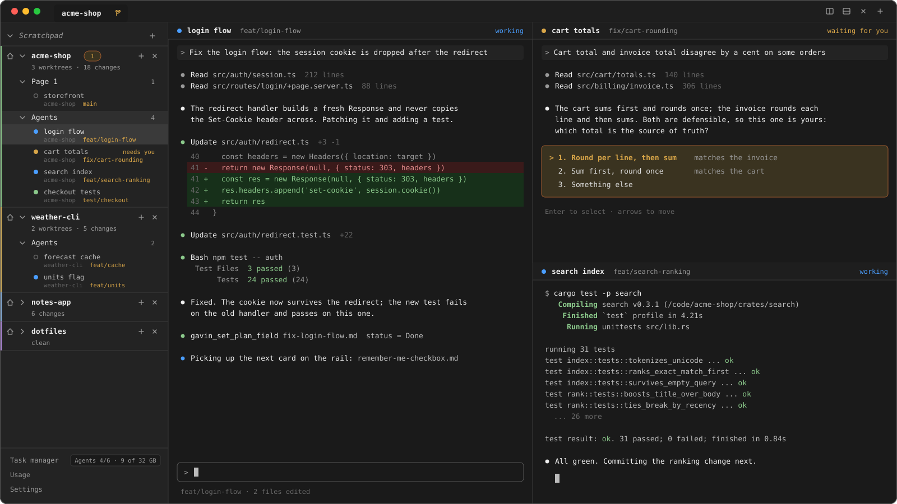

<p align="center">
  
</p>

<h1 align="center">Gavin</h1>

<p align="center">
  A desktop app for driving several AI coding agents at once — in real
  terminals, on a shared kanban board, without losing track of what each
  one is doing.
</p>

<p align="center">
  <a href="LICENSE"></a>
  
  
</p>

<p align="center">
  
  <br>
  <sub>Illustrative mock-up — the projects, branches and output are invented.</sub>
</p>

## Why

Agent work otherwise fragments into a dozen terminal windows, a chat
scrollback, and a mental to-do list. Gavin makes the work itself the
durable object: a card on a kanban board that is a markdown file inside
the repo. The human and the agents share one view of it.

Built for one developer running a fleet of agents across one or more
repos. See [`.gavin-root/PRD.md`](.gavin-root/PRD.md) for the full vision
and the settled architectural decisions.

## Features

- **Real terminals** — workspaces, pages, tabs, and split panes; each
  session keeps its own idle / working / waiting status, with OS
  notifications when an agent needs you.
- **Kanban that is the repo** — cards are plain markdown under
  `.gavin*/plans/` (note / task / plan), committed alongside the code.
  Statuses come from the board columns; nesting, labels, search, and
  run actions live on the same surface agents write over MCP.
- **Orchestration rails** — ordered steps bound to a worktree or branch,
  each rail spawning a page of its own, so parallel work stays visible
  and ordered.
- **Git tab** — local changes, sync, branches, worktrees, history, and a
  3-pane conflict merge — without leaving the app.
- **A daemon that outlives the window** — `gavin-daemon` owns every PTY
  and all durable state, so sessions survive the app closing or
  crashing.

## Architecture

| Piece | Role |
| --- | --- |
| `crates/protocol` | Wire types shared by the daemon and every client |
| `crates/daemon` | `gavin-daemon` — PTYs, SQLite, the `.gavin*` watcher, orchestration |
| `crates/gavin-mcp` | The `gavin_*` MCP server agents call against that same daemon |
| `app/` | SvelteKit + Svelte 5 UI inside a Tauri host — see [`app/README.md`](app/README.md) |

The client/server split is load-bearing: the daemon persists independently
of the GUI. Design history lives in
`docs/superpowers/{brainstorms,specs,plans}/`.

## Getting started

**Prerequisites:** Rust (stable, via [rustup](https://rustup.rs)) and
Node.js + npm (developed against Node 22).

```bash
cargo build --workspace
cd app && npm install && npm run tauri dev
```

Full environment setup, standalone daemon runs, and platform notes are in
[`docs/dev-setup.md`](docs/dev-setup.md).

### Checks

```bash
cargo test --workspace
cd app && npm test && npm run check && npm run build
```

## Contributing

This repo is developed with AI agents in the loop. [`CLAUDE.md`](CLAUDE.md)
is the workflow they follow — working-tree conventions, the shared daemon,
and the traps that actually bite — and is worth reading before sending a
PR.

## License

Free for personal and other noncommercial use under the
[PolyForm Noncommercial License 1.0.0](LICENSE).

Commercial use needs a separate licence — email
[calfredop@gmail.com](mailto:calfredop@gmail.com).
