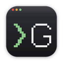
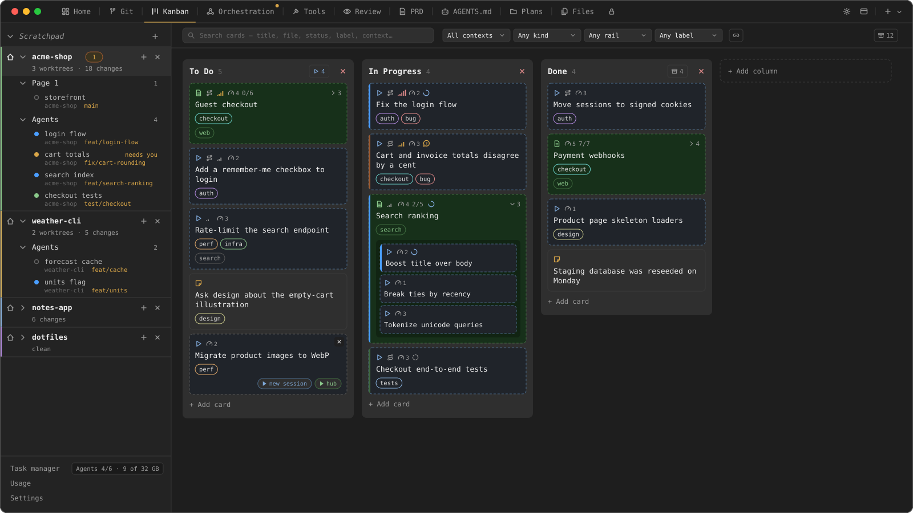
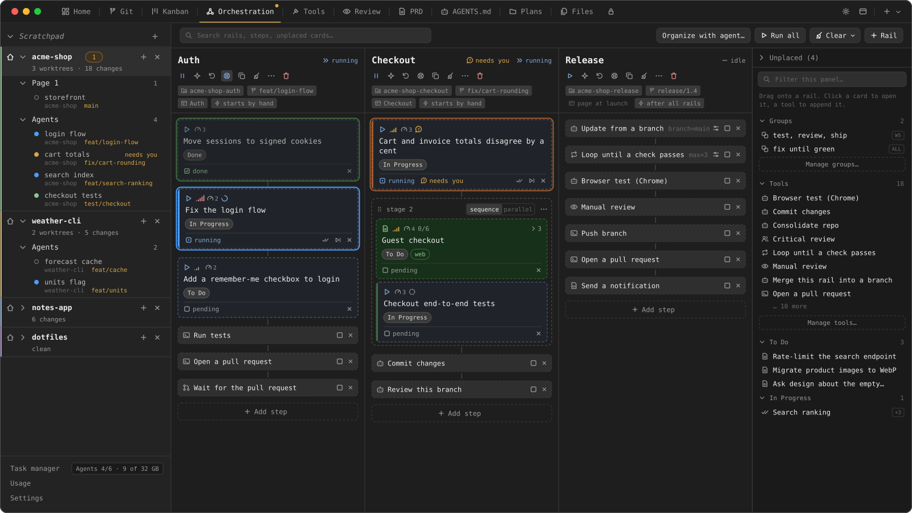

<p align="center">
  
</p>

<h1 align="center">Gavin</h1>

<p align="center">
  A desktop app for driving several AI coding agents at once — in real
  terminals, on a shared kanban board, without losing track of what each
  one is doing.
</p>

<p align="center">
  <a href="LICENSE"></a>
  
  
</p>

<p align="center">
  
  <br>
  <sub>The images on this page are illustrative mock-ups — the projects, cards, branches and output are invented.</sub>
</p>

## Why

Agent work otherwise fragments into a dozen terminal windows, a chat
scrollback, and a mental to-do list. Gavin makes the work itself the
durable object: a card on a kanban board that is a markdown file inside
the repo. The human and the agents share one view of it.

Built for one developer running a fleet of agents across one or more
repos. See [`.gavin-root/PRD.md`](.gavin-root/PRD.md) for the full vision
and the settled architectural decisions.

## Features

Every workspace opens on a **hub** — Home, Git, Kanban, Orchestration,
Tools, Review and the repo's own documents as tabs. Two of those tabs are
where the work is decided; the terminals are where it happens.

### Kanban that is the repo

Cards are plain markdown under `.gavin*/plans/`, committed alongside the
code, and come in three kinds: a **note** is a reminder, a **task** is one
unit of agent work whose body *is* the prompt, a **plan** is a checklist
that can nest tasks of its own. Statuses come from the board's columns.
Run a card and it becomes a live session — the card carries that
session's working / waiting / idle mark from then on. Labels, priority,
complexity, search and filters live on the same surface the agents write
to over MCP, so the board the human reads is the board the agents keep.

### Orchestration rails

<p align="center">
  
</p>

A **rail** is a column of ordered steps bound to a worktree and a branch,
and it runs on a page of its own — so parallel work stays parallel,
visible, and in order. A step is either a card from the board or a
**tool**: run the tests, loop until a check passes, open a pull request
and wait for it, review the branch, merge, notify. Steps group into
stages that run in sequence or in parallel; a rail starts by hand, after
another rail, or after all of them. When an agent stops to ask something,
the rail says *needs you* and waits.

### Real terminals

<p align="center">
  
</p>

Workspaces, pages, tabs and split panes over real PTYs. Each session
keeps its own idle / working / waiting status in the sidebar, with OS
notifications when an agent needs you.

### And underneath

- **Git tab** — local changes, sync, branches, worktrees, history, and a
  3-pane conflict merge — without leaving the app.
- **A daemon that outlives the window** — `gavin-daemon` owns every PTY
  and all durable state, so sessions survive the app closing or
  crashing.

## Architecture

| Piece | Role |
| --- | --- |
| `crates/protocol` | Wire types shared by the daemon and every client |
| `crates/daemon` | `gavin-daemon` — PTYs, SQLite, the `.gavin*` watcher, orchestration |
| `crates/gavin-mcp` | The `gavin_*` MCP server agents call against that same daemon |
| `app/` | SvelteKit + Svelte 5 UI inside a Tauri host — see [`app/README.md`](app/README.md) |

The client/server split is load-bearing: the daemon persists independently
of the GUI. Design history lives in
`docs/superpowers/{brainstorms,specs,plans}/`.

## Getting started

**Prerequisites:** Rust (stable, via [rustup](https://rustup.rs)) and
Node.js + npm (developed against Node 22).

```bash
cargo build --workspace
cd app && npm install && npm run tauri dev
```

Full environment setup, standalone daemon runs, and platform notes are in
[`docs/dev-setup.md`](docs/dev-setup.md).

### Checks

```bash
cargo test --workspace
cd app && npm test && npm run check && npm run build
```

## Contributing

This repo is developed with AI agents in the loop. [`CLAUDE.md`](CLAUDE.md)
is the workflow they follow — working-tree conventions, the shared daemon,
and the traps that actually bite — and is worth reading before sending a
PR.

## License

Free for personal and other noncommercial use under the
[PolyForm Noncommercial License 1.0.0](LICENSE).

Commercial use needs a separate licence — email
[calfredop@gmail.com](mailto:contact@cosimoalfredopinalari.me).
